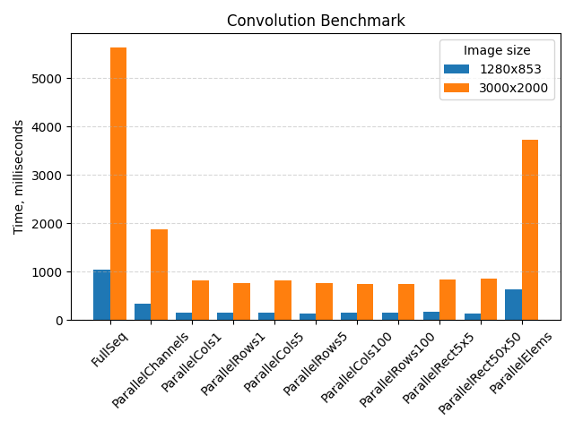

# Image convolution

CLI-приложение для свёртки изображений с различными ядрами свёртки,
а также сравнения различных параллельных реализаций свёртки и пайплайнов для свёртки массива изображений.

Приложение поддерживает 8битные изображения с одним или тремя каналами (RGB).

## Quick start

Для работы приложения требуется JDK 21+.

Для запуска свёртки над одним изображением:

```bash
./gradlew run --args="path/to/image.png filterName"
```

Свёрнутое изображение сохранится как output_image.

Для запуска свёртки над всеми изображениями в директории:

```bash
./gradlew run --args="path/to/folder filterName"
```

Свёрнутые изображения сохранятся в директорию output_images.

Доступные фильтры:

- id
- boxBlur
- motionBlur
- gaussianBlur3x3
- gaussianBlur5x5
- edges
- sharpen5
- sharpen8
- embos

## Реализация

В приложении есть различные реализации свёртки:

- полностью последовательная свёртка
- параллельное разделение по каналам изображения (для RGB)
- параллельное разделение по строкам изображения
- параллельное разделение по столбцам изображения
- параллельное разделение по пикселям изображения
- параллельное разделение по прямоугольникам изображения

Все параллельные реализации используют разделение по каналам изображения.

Также реализован асинхронный пайплайн для свёртки массива изображений,
который читает, сворачивает и записывает изображения.

## Эксперимент

Были произведены следующие эксперименты:

- сравнение различных реализаций свёртки на изображениях размером 1280x853 и 3000x2000 пикселей.
- сравнения последовательного и асинхронного пайплайна.

### Условия эксперимента

- процессор: Ryzen 7 5800H (8C/16T)
- оперативная память: 16 ГБ DDR4
- операционная система: Debian 12 (with Linux 6.12.22)

### Свёртка

Результаты сравнения различных реализаций свёртки представлены в таблице ниже.
В ней представлено среднее время свёртки и среднее отклонение для двух изображений.

| Размер изображения  | Полностью последовательная | Разделение каналов | По 1 столбцу | По 1 строке | По 5 столбцов | По 5 строк | По 100 столбцов | По 100 строк | Прямоугольники 5×5 | Прямоугольники 50×50 | По элементам  |
|---------------------|----------------------------|--------------------|--------------|-------------|---------------|------------|-----------------|--------------|--------------------|----------------------|---------------|
| 1280×853 (bird.png) | 1032 ± 2 ms                | 329 ± 3 ms         | 151 ± 4 ms   | 144 ± 6 ms  | 152 ± 4 ms    | 142 ± 8 ms | 157 ± 7 ms      | 144 ± 3 ms   | 161 ± 10 ms        | 138 ± 5 ms           | 632 ± 62 ms   |
| 3000×2000 (kha.bmp) | 5642 ± 11 ms               | 1875 ± 10 ms       | 822 ± 13 ms  | 759 ± 4 ms  | 824 ± 8 ms    | 759 ± 7 ms | 743 ± 3 ms      | 736 ± 11 ms  | 833 ± 58 ms        | 847 ± 2 ms           | 3726 ± 901 ms |± 94 ms | 840 ± 2 ms | 4745 ± 1383 ms |

И на диаграмме:



Лучшее время работы получилось при разделении по строкам, столбцам и прямоугольникам.
Разница между разделением по строкам, столбцам и прямоугольникам оказалась невелика.

Разделение по каждому пикселю оказалось неэффективно.
Разделение только по каналам изображения также оказалось менее неэффективно.

### Пайплайны

Результаты сравнения асинхронного и последовательного пайплайна для обработки массива изображений
представлено в таблице ниже.
В ней представлено среднее время свёртки и среднее отклонение для массива изображений, состоящего из
7 изображений 1280×853 и 8 изображений 3000×2000, при различных реализациях свёртки.

| Пайплайн         | Полностью последовательная реализация | Разделение каналов | Разделение по пять столбцов | Разделение по 5 строк | Разделение по прямоугольникам 50×50 |
|------------------|---------------------------------------|--------------------|-----------------------------|-----------------------|-------------------------------------|
| Асинхронный      | 9.7 ± 0.2 с                           | 9.6 ± 0.4 с        | 8.2 ± 0.4 с                 | 8.2 ± 0.3 с           | 7.8 ± 0.2 с                         |
| Последовательный | 55.7 ± 0.2 с                          | 20.4 ± 0.6 с       | 11.1 ± 0.0 с                | 10.8 ± 0.4 с          | 10.4 ± 0.0 с                        |

И на диаграмме:


Асинхронный пайплайн оказался лучше при всех реализациях свёртки.

Лучшее время работы получилось при использовании разделения по 5 столбцам, 5 строкам и прямоугольникам 50×50.

Особой разницы между разделением по 5 столбцам, 5 строкам и прямоугольникам не наблюдается.

## Тестирование

Тестирование производилось путём сравнивания реализации из
библиотеки [Boofcv](https://github.com/lessthanoptimal/BoofCV)
с допустимой погрешностью пикселей, равной единице.

Протестированы различные реализации свёртки (параллельные и последовательная) с различными фильтрами на
изображениях различных размеров.

Для запуска тестов:

```bash
./gradlew test  
```

## Структура репозитория

```text
.
├── app - модуль с CLI, последовательным и параллельным пайплайном и бенчмарками. 
├── buildSrc - общие зависимости и конфигурации модулей.
├── convolution - свёртка изображений и различные ядра свёртки.
├── images - изображения для тестов и бенчмарков.
├── plotting - python скрипты для построения графиков результатов бенчмарков.
```

## Использованные технологии

- [BoofCV](https://github.com/lessthanoptimal/BoofCV) - для загрузки, получения каналов изображения и записи
  изображений.
- [jmh](https://github.com/openjdk/jmh) - для бенчмарков.